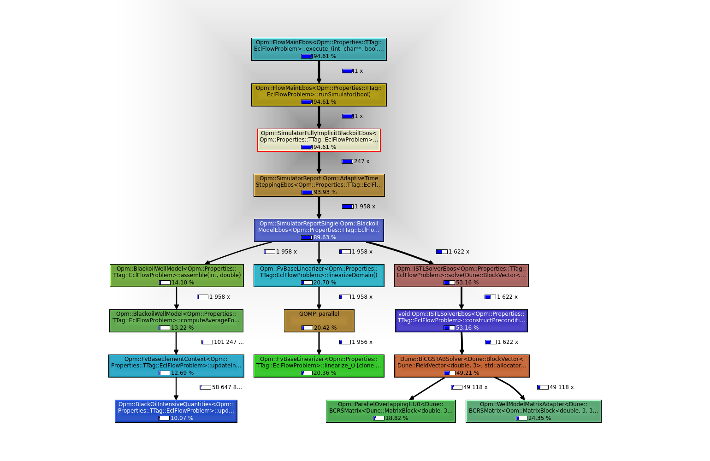

## Resultados obtidos com os perfiladores

Descrição dos arquivos:

* callgrind.out.3689: Arquivo contendo a saída da farramenta valgrind
* perf.data.tar.gz: Arquivo comprimido contendo a saída do perf

A imagem abaixo apresenta o callgraph utilizando a ferramenta valgrind para avaliar as chamadas e kcachegrind para gerar o grafo.

