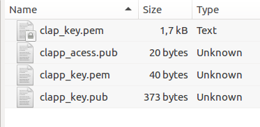
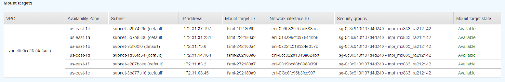
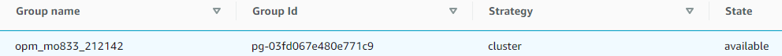

## Informações básicas

Autor: Matheus Ferraroni Sanches

RA: 212142

Data: 29/06/2020

Aplicação: <a href="https://opm-project.org/">OPEN POROUS MEDIA (OPM)</a>.


## Reprodução dos Experimentos

* Pasta de credenciais do Clap deve ter o mesmo nome das credenciais usadas neste trabalho. Alguns dos scripts fazem referências direta a elas.
* Tutorial feito para ubuntu Ubuntu 18.04.4 Desktop (64-bit) (http://releases.ubuntu.com/18.04/ubuntu-18.04.4-desktop-amd64.iso.torrent?_ga=2.71374547.1733202993.1593114621-1005120194.1584732179)


### Preparar ambiente local

1. Instalar CLAP
  * ```sudo apt-get install gcc g++ git libc6-dev libffi-dev libssl-dev virtualenv python3 python3-pip```
  * ```git clone https://github.com/lmcad-unicamp/CLAP.git clap```
  * ```cd clap```
  * ```chmod +x install.sh```
  * ```./install.sh```
2. Ative o virtual-env do CLAP
  * ```source clap-env/bin/activate```
  * ```cd ~```
3. Clone os scripts e pastas necessárias
  * git clone https://github.com/MatheusFerraroni/opm-mo833
  * Copiar as pastas ~/opm-mo833/clap/configs e ~/opm-mo833/clap/group para ~/.clap/
4. Configure as chaves na pasta ~/.clap/private de acordo com o arquivo na url (https://git.io/JfjYw)

5. Preparar dependências locais
  * ```cd ~/opm-mo833/scripts_to_use```
  * Execute o script prepare_local.sh (Responsável por criar a pasta ~/experimental_results)
6. Agora é preciso preparar as dependências no AWS e os clusters já podem ser executados

### Preparar dependências no AWS

Uma vez que o ambiente local esteja pronto, é preciso criar o security group, EFS e placement group que serão utilizados nos próximos passos. Além disso, é preciso executar a máquina responsável por compilar o OPM antes de começar os testes.

Para preparar as dependências no AWS vá até a pasta ~/opm-mo833/scripts_to_use e execute o script “prepare_aws.sh”. Agora é possível conferir no console que os recursos foram criados. A imagem abaixo mostra o EFS disponível para ser utilizado nas subnets da região utilizada, já com o security group que foi criado selecionado.

Também é possível ver que o placement group já está disponível para ser utilizado.



### Apagar dependências no AWS
Para apagar o security group, EFS e placement group que foram criados basta executar o script “cleaner.sh” na pasta ~/opm-mo833/scripts_to_use. Isso deve ser feito apenas no final de todas as execuções dos clusters desejados, já que o código que foi compilado e armazenado no EFS será perdido.

### Compilar OPM
Assim que as dependências no AWS estejam prontas é possível executar o script de compilação do OPM. Para compilar o OPM e adiciona-lo no EFS basta executar o script “compile.sh” na pasta ~/opm-mo833/scripts_to_use. Ao completar sua tarefa a máquina criada é destruída e o OPM estará no EFS.

### Executar clusters
Uma vez que o OPM esteja compilado é possível iniciar os clusters que vão executar os datasets. Para isso vá até a pasta ~/opm-mo833/scripts_to_use, onde o script “run_cluster.sh” pode ser utilizado. A sintaxe de chamada desse script é a seguinte:

	* sh ./run_cluster.sh {max-pi} {cluster}

Ex:

	* sh ./run_cluster.sh 0 t2small1

	* sh ./run_cluster.sh 100 t3small2

	* sh ./run_cluster.sh 1000 t3xlarge4

	* sh ./run_cluster.sh 100000 c5xlarge8

A execução desse script cria as instâncias necessárias, configura elas, executa os datasets e baixa os resultados para a máquina local.

### Gerar gráficos
Para gerar os gráficos e arquivos csv é necessário instalar duas bibliotecas no virtual env do clap:
	* pip install numpy

	* pip install matplotlib

Uma vez que elas estejam instaladas basta ir na pasta ~/opm-mo833/scripts_to_use e executar o comando

	* python plotter.py
Os gráficos e arquivos vão ser gerados na pasta ~/experimental_results/*

